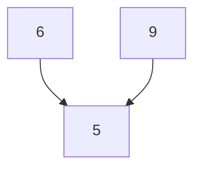
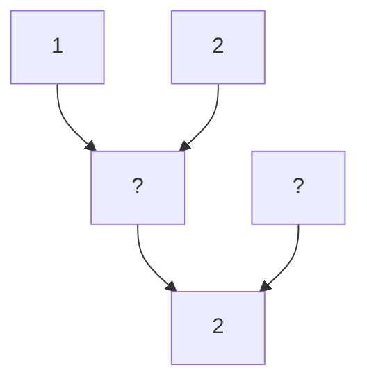

### Task 1

The operation $\bigstar$ adds two numbers and then divides the result of the addition by 3. For example:  
$6 \bigstar 9 = (6 + 9) : 3 = 5$ (see Graph 1).  

What number is in the gray field of Graph 2?

**Graph 1:**

**Graph 2:**

The task is to finish the Graph 2.

### Task 2

Prove that $a \bigstar b = b \bigstar a$.
