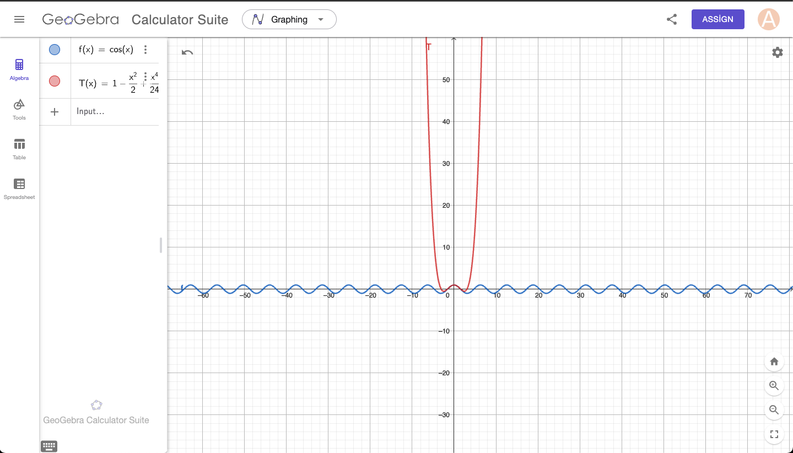
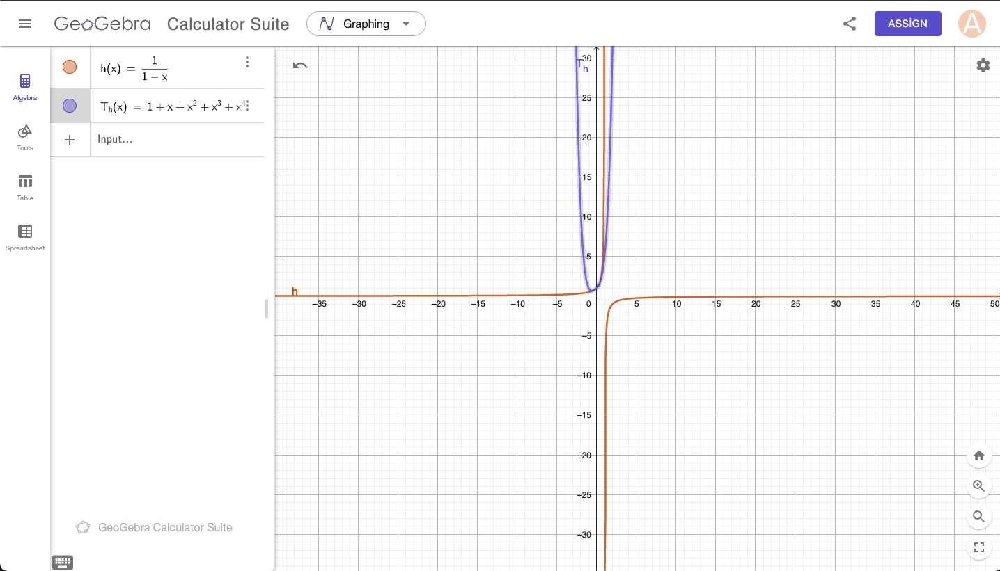
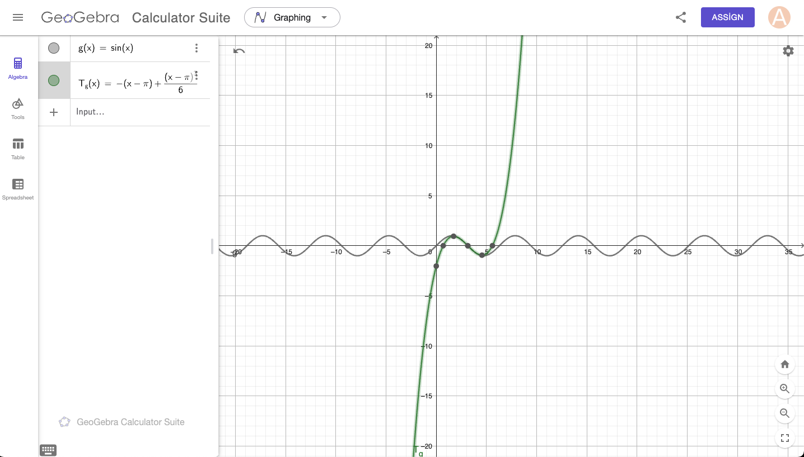
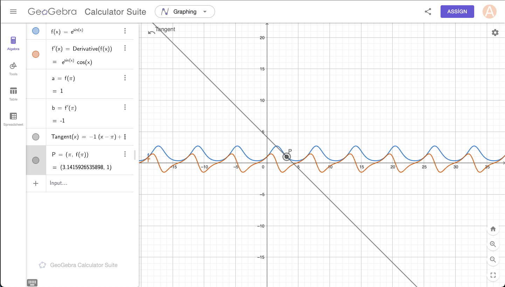

# 23. Taylor Series

1. Find the Taylor series and visualize the obtained functions in GeoGebra.

2.  f(x) = cos(x) around x = 0 up to the 4th degree.

3.  h(x) = {1}/{1 - x} around x = 0 up to the 4th degree.

4.  g(x) = sin(x) around x = pi up to the 4th degree.

5. Find a tangent line:
   $$ 
   y = f'(x_0)(x - x_0) + f(x_0) 
   $$
   to the function f(x) = e^{sin(x)} at x_0 = pi.

### Hints for GeoGebra Visualization:
- Define f(x)
- Include slider s
- Define the tangent line as:
   $$ 
   y = f'(s)(x - s) + f(s) 
   $$
- Include the point P(s, f(s))

---
## Taylor series general formula

$$
f(x) \approx f(a) + f{\prime}(a)(x-a) + \frac{f{\prime}{\prime}(a)}{2!}(x-a)^2 + \frac{f{\prime}{\prime}{\prime}(a)}{3!}(x-a)^3 + \dots
$$

---
 ## Questions

 f(x) = cos(x) around x = 0 up to the 4th degree.

Calculate the derivates
$$
f^{(4)}(x) = \cos(x) .
$$
Evaluate the derivatives at  x = 0 :
$$
f^{(4)}(0) = \cos(0) = 1
$$

## Formula
$$
\cos(x) \approx f(0) + \frac{f{\prime}(0)}{1!}x + \frac{f{\prime}{\prime}(0)}{2!}x^2 + \frac{f{\prime}{\prime}{\prime}(0)}{3!}x^3 + \frac{f^{(4)}(0)}{4!}x^4
$$

$$
\cos(x) \approx 1 - \frac{x^2}{2!} + \frac{x^4}{4!}
$$

	
---

## Questions

h(x) = {1}/{1 - x} around x = 0 up to the 4th degree.

---

## Questions
 g(x) = sin(x) around x = pi up to the 4th degree.

---

## Questions

 Find a tangent line:
   $$ 
   y = f'(x_0)(x - x_0) + f(x_0) 
   $$
   to the function f(x) = e^{sin(x)} at x_0 = pi.

---

# 24. Integrals

## 1. Compute:

### 1.
 $$
\int 1 \, dx 
 $$

The integral of a constant function is straightforward. For a constant value c:
$$
\int c \, dx = c \cdot x + C
$$
Here, 
$$ c = 1 $$
so:
$$
\int 1 \, dx = x + C
$$
where 
$$ C $$ 
is the integration constant.

---

### 2. 
$$ \int (x^2 + 2) \, dx $$
The integral of a sum is the sum of integrals:
$$
\int (x^2 + 2) \, dx = \int x^2 \, dx + \int 2 \, dx
$$
#### Step 1: Compute each term:
1. For  \int x^2 \, dx, apply the power rule:
   $$ \int x^n \, dx = \frac{x^{n+1}}{n+1} \quad \text{(for } n \neq -1 \text{)} $$
   $$ \int x^2 \, dx = \frac{x^{2+1}}{2+1} = \frac{x^3}{3} $$

2. For $$ \int 2 \, dx $$:
   $$ \int 2 \, dx = 2 \cdot x $$

#### Step 2: Combine the results:
$$
\int (x^2 + 2) \, dx = \frac{x^3}{3} + 2x + C
$$

---

### 3. 
$$ \int 2 \sin(x) \, dx $$
#### Step 1: Factor out the constant:
$$
\int 2 \sin(x) \, dx = 2 \int \sin(x) \, dx
$$

#### Step 2: Compute the integral of sin(x):
The integral of 
$$
\sin(x) 
$$ 

$$
\int \sin(x) \, dx = -\cos(x)
$$

#### Step 3: Multiply by the constant:
$$
\int 2 \sin(x) \, dx = 2 \cdot (-\cos(x)) = -2\cos(x) + C
$$

---

### 4. 
$$ 
\int \frac{3}{x^2} \, dx
 $$
#### Step 1: Rewrite the term:
$$
\frac{3}{x^2} = 3x^{-2}
$$

#### Step 2: Apply the power rule:
The power rule is:
$$
\int x^n \, dx = \frac{x^{n+1}}{n+1}, \quad n \neq -1
$$
Here, 
$$ 
n = -2 
$$

$$
\int x^{-2} \, dx = \frac{x^{-2+1}}{-2+1} = \frac{x^{-1}}{-1} = -\frac{1}{x}
$$

#### Step 3: Multiply by the constant:
$$
\int \frac{3}{x^2} \, dx = 3 \cdot \left( -\frac{1}{x} \right) = -\frac{3}{x} + C
$$

---

### 5. 
$$ 
\int \left( \frac{1}{3}x^4 - 5 \right) \, dx
$$
#### Step 1: Split the integral:
$$
\int \left( \frac{1}{3}x^4 - 5 \right) \, dx = \frac{1}{3} \int x^4 \, dx - 5 \int 1 \, dx
$$

#### Step 2: Compute each term:
1. For 
$$ 
\frac{1}{3} \int x^4 \, dx
$$
   $$ \int x^4 \, dx = \frac{x^{4+1}}{4+1} = \frac{x^5}{5} $$
   Multiply by
$$ 
\frac{1}{3}
$$
   $$ \frac{1}{3} \cdot \frac{x^5}{5} = \frac{x^5}{15} $$

2. For 
$$ 
-5 \int 1 \, dx 
$$
   $$ \int 1 \, dx = x $$
   Multiply by 
   $$ -5 $$
   $$ -5x $$

#### Step 3: Combine the results:
$$
\int \left( \frac{1}{3}x^4 - 5 \right) \, dx = \frac{x^5}{15} - 5x + C
$$

---

### 6. 
$$ \int \left( \sin^2(x) + \cos^2(x) \right) \, dx $$
#### Step 1: Use the trigonometric identity:
$$
\sin^2(x) + \cos^2(x) = 1
$$
So the integral becomes:
$$
\int \left( \sin^2(x) + \cos^2(x) \right) \, dx = \int 1 \, dx
$$

#### Step 2: Compute the integral:
$$
\int 1 \, dx = x + C
$$

#### Final Answer:
$$
\int \left( \sin^2(x) + \cos^2(x) \right) \, dx = x + C
$$

---

### 7. 
$$ \int \left( 5 \sin(x) + 3e^x \right) \, dx $$
#### Step 1: Split the integral:
$$
\int \left( 5 \sin(x) + 3e^x \right) \, dx = 5 \int \sin(x) \, dx + 3 \int e^x \, dx
$$

#### Step 2: Compute each term:
1. For 
$$ \int \sin(x) \, dx $$
   $$ \int \sin(x) \, dx = -\cos(x) $$
   Multiply by 5:
   $$ 5 \cdot (-\cos(x)) = -5\cos(x) $$

2. For 
$$ \int e^x \, dx $$
   $$ \int e^x \, dx = e^x $$
   Multiply by 3:
   $$ 3 \cdot e^x = 3e^x $$

#### Step 3: Combine the results:
$$
\int \left( 5 \sin(x) + 3e^x \right) \, dx = -5\cos(x) + 3e^x + C
$$

---

### 8. 
$$ \int \sqrt{x} \, dx $$
#### Step 1: Rewrite 
$$ \sqrt{x} $$

as a power:
$$
\sqrt{x} = x^{1/2}
$$

#### Step 2: Apply the power rule:
$$
\int x^n \, dx = \frac{x^{n+1}}{n+1}, \quad n = \frac{1}{2}
$$
Compute:
$$
\int x^{1/2} \, dx = \frac{x^{1/2 + 1}}{1/2 + 1} = \frac{x^{3/2}}{3/2} = \frac{2}{3}x^{3/2} + C
$$

---

### 9. 
$$ \int \sqrt[3]{x} \, dx $$
#### Step 1: Rewrite 
$$ \sqrt[3]{x} $$ 
as a power:
$$
\sqrt[3]{x} = x^{1/3}
$$

#### Step 2: Apply the power rule:
$$
\int x^n \, dx = \frac{x^{n+1}}{n+1}, \quad n = \frac{1}{3}
$$
Compute:
$$
\int x^{1/3} \, dx = \frac{x^{1/3 + 1}}{1/3 + 1} = \frac{x^{4/3}}{4/3} = \frac{3}{4}x^{4/3} + C
$$

---

### 10. 
$$ \int \sqrt{10}x \, dx $$
#### Step 1: Factor out 
$$ \sqrt{10} $$
$$
\int \sqrt{10}x \, dx = \sqrt{10} \int x \, dx
$$

#### Step 2: Compute the integral of 
$$ x $$
$$
\int x \, dx = \frac{x^2}{2}
$$

#### Step 3: Multiply by 
$$ \sqrt{10} $$
$$
\int \sqrt{10}x \, dx = \sqrt{10} \cdot \frac{x^2}{2} = \frac{\sqrt{10}x^2}{2} + C
$$

---

### 11. 
$$ \int \cos\left(\frac{5}{2}x + 3\right) \, dx $$
1. Use the formula for 
$$ \int \cos(kx + c) \, dx $$
   $$ \int \cos(kx + c) \, dx = \frac{\sin(kx + c)}{k} $$

2. Here, 
$$ k = \frac{5}{2} $$
   $$ \int \cos\left(\frac{5}{2}x + 3\right) \, dx = \frac{\sin\left(\frac{5}{2}x + 3\right)}{\frac{5}{2}} $$

3. Simplify:
   $$ \frac{\sin\left(\frac{5}{2}x + 3\right)}{\frac{5}{2}} = \frac{2}{5}\sin\left(\frac{5}{2}x + 3\right) $$

- **Final Answer:**
  $$ \frac{2}{5}\sin\left(\frac{5}{2}x + 3\right) + C $$

---

### 12. $$ \int \frac{\cos(\ln(x))}{x} \, dx $$
1. Let 
$$ u = \ln(x) $$
so:
   $$ du = \frac{1}{x} \, dx $$

2. Substitute:
   $$ \int \frac{\cos(\ln(x))}{x} \, dx = \int \cos(u) \, du $$

3. Compute the integral of $$ \cos(u) $$:
   $$ \int \cos(u) \, du = \sin(u) $$

4. Substitute back 
$$ u = \ln(x) $$
   $$ \int \frac{\cos(\ln(x))}{x} \, dx = \sin(\ln(x)) $$

- **Final Answer:**
  $$ \sin(\ln(x)) + C $$

---

### 13. 
$$ \int x \ln(x) \, dx $$
1. Use integration by parts:
   $$ \int u \, dv = uv - \int v \, du $$

2. Let:
   - $$ u = \ln(x), \, dv = x \, dx $$
   - $$ du = \frac{1}{x} \, dx, \, v = \frac{x^2}{2} $$

3. Apply the formula:
   $$ \int x \ln(x) \, dx = \frac{x^2}{2} \ln(x) - \int \frac{x^2}{2} \cdot \frac{1}{x} \, dx $$

4. Simplify:
   $$ \int x \ln(x) \, dx = \frac{x^2}{2} \ln(x) - \frac{1}{2} \int x \, dx $$

5. Compute 
$$ \int x \, dx $$
   $$ \int x \, dx = \frac{x^2}{2} $$

6. Combine terms:
   $$ \int x \ln(x) \, dx = \frac{x^2}{2} \ln(x) - \frac{x^2}{4} $$

- **Final Answer:**
  $$ \frac{x^2}{2} \ln(x) - \frac{x^2}{4} + C $$

---

### 14. 
$$ \int x e^x \, dx $$
1. Use integration by parts:
   $$ \int u \, dv = uv - \int v \, du $$

2. Let:
   - $$ u = x, \, dv = e^x \, dx $$
   - $$ du = dx, \, v = e^x $$

3. Apply the formula:
   $$ \int x e^x \, dx = x e^x - \int e^x \, dx $$

4. Compute 
$$ \int e^x \, dx $$
   $$ \int e^x \, dx = e^x $$

5. Combine terms:
   $$ \int x e^x \, dx = x e^x - e^x $$

- **Final Answer:**
  $$ e^x (x - 1) + C $$

---

### 15. 
$$ \int x e^x \, dx $$
#### Step 1: Identify the method to use
This is a product of two functions, 
$$ x $$
and 
$$ e^x $$
We use **integration by parts**, which states:
$$
\int u \, dv = uv - \int v \, du
$$

#### Step 2: Choose 
$$ u $$ 
and 
$$ dv $$
Let:
- $$ u = x $$ 
(this simplifies upon differentiation)
- $$ dv = e^x \, dx $$ 
(this is easy to integrate)

Then:
- $$ du = dx $$ 
(derivative of $$ x $$)
- $$ v = e^x $$ 
(integral of 
$$ e^x $$
)

#### Step 3: Apply the integration by parts formula
Using the formula:
$$
\int x e^x \, dx = u \cdot v - \int v \, du
$$
Substitute the values of 
$$ u, v, du $$
$$
\int x e^x \, dx = x \cdot e^x - \int e^x \, dx
$$

#### Step 4: Compute the remaining integral
The integral of 
$$ e^x $$
 is
$$
\int e^x \, dx = e^x
$$
Substitute this result:
$$
\int x e^x \, dx = x e^x - e^x
$$

#### Step 5: Simplify and add the constant of integration
Factor out 
$$ e^x $$
$$
\int x e^x \, dx = e^x (x - 1) + C
$$

---

### Final Answer:
$$
\int x e^x \, dx = e^x (x - 1) + C
$$

---