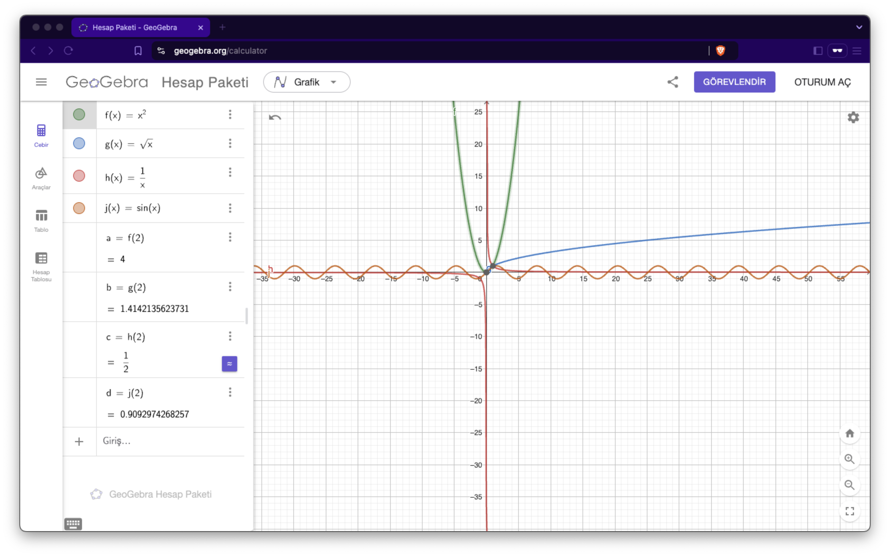
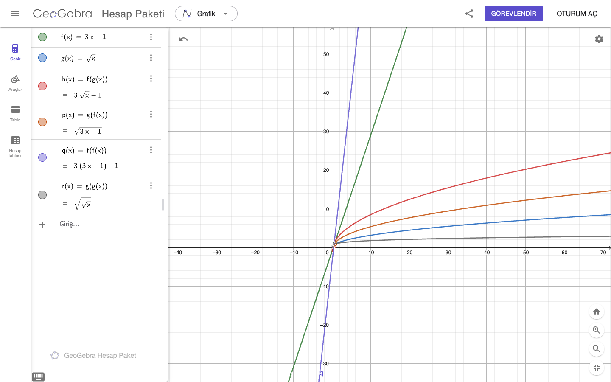
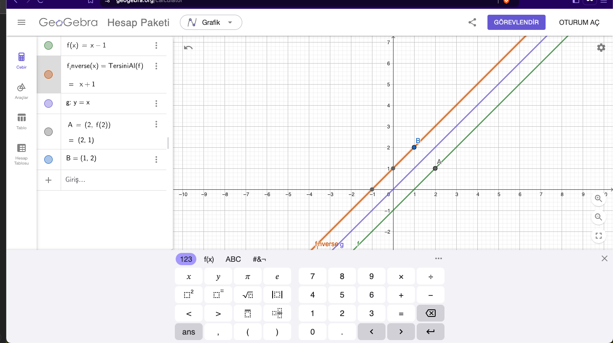

# 18. Functions
 
## Questions

1. Draw in a single Geogebra notebook the following functions:
   - $f(x) = x^2$
   - $g(x) = \sqrt{x}$
   - $h(x) = \frac{1}{x}$
   - $j(x) = \sin(x)$

Find value of all the above functions at $x = 2$.

2. Let $f(x) = 3x - 1$ and $g(x) = \sqrt{x}$. Find:
   - $f(g(x))$
   - $g(f(x))$
   - $f(f(x))$
   - $g(g(x))$

and visualize functions in a single Geogebra notebook.

## 3. Let $f(x) = e^x$ and $g(x) = \ln(x)$. Check: $f(g(x))$ and $g(f(x))$. What do you notice?

### Step 1: Understanding the functions
- $f(x) = e^x$: The exponential function.
- $g(x) = \ln(x)$: The natural logarithm function.

### Step 2: Calculating $f(g(x))$
- $g(x) = \ln(x)$, so:
  $$
  f(g(x)) = f(\ln(x)) = e^{\ln(x)}
  $$
- Using the property $e^{\ln(x)} = x$ (for $x > 0$), we simplify:
  $$
  f(g(x)) = x
  $$

### Step 3: Calculating $g(f(x))$
- $f(x) = e^x$, so:
  $$
  g(f(x)) = g(e^x) = \ln(e^x)
  $$
- Using the property $\ln(e^x) = x$, we simplify:
  $$
  g(f(x)) = x
  $$

### Conclusion:
- Both $f(g(x)) = x$ and $g(f(x)) = x$. This means that $f(x)$ and $g(x)$ are **inverse functions** of each other. Applying one function and then the other restores the original input.

## **4. We have function $f = \{(1, 7), (2, 9), (3, 11)\}$. Give the inverse function $f^{-1}$.**

### Step 1: Understanding the inverse
- The inverse of a function swaps the $x$ and $y$ values. That is, if $f(a) = b$, then $f^{-1}(b) = a$.

### Step 2: Swap the pairs
- Original function: $f = \{(1, 7), (2, 9), (3, 11)\}$
- Swapping $x$ and $y$, the inverse function is:
  $$
  f^{-1} = \{(7, 1), (9, 2), (11, 3)\}
  $$

### Conclusion:
- The inverse function is:
  $$
  f^{-1} = \{(7, 1), (9, 2), (11, 3)\}
  $$

---

5. We have function $f=\{(1,7), (2,7), (3,11)\}$. Give inverse function $f^{-1}$.

## **5. We have function $f = \{(1, 7), (2, 7), (3, 11)\}$. Give the inverse function $f^{-1}$.**

### Step 1: Understanding the inverse
- The inverse of a function swaps the $x$ and $y$ values.

### Step 2: Check for one-to-one property
- A function must be **one-to-one** to have an inverse. In $f = \{(1, 7), (2, 7), (3, 11)\}$:
  - Both $1$ and $2$ map to $7$.
  - This violates the one-to-one property.

### Conclusion:
- The function $f$ is **not one-to-one**, so its inverse does **not exist**.

---

## **6. We have function $f(x) = x - 1$. Give the inverse function $f^{-1}$. Show both functions on the same GeoGebra notebook.**

### Step 1: Solve for the inverse
- Start with $y = f(x) = x - 1$.
- Swap $x$ and $y$: $x = y - 1$.
- Solve for $y$: 
  $$
  y = x + 1
  $$
- Thus, the inverse function is:
  $$
  f^{-1}(x) = x + 1
  $$

### Step 2: Observations about the graph
- $f(x) = x - 1$ is a straight line with slope $1$ and $y$-intercept $-1$.
- $f^{-1}(x) = x + 1$ is a straight line with slope $1$ and $y$-intercept $1$.
- The two functions are symmetric about the line $y = x$.

### Step 3: Plotting in GeoGebra
- Plot $f(x) = x - 1$.
- Plot $f^{-1}(x) = x + 1$.
- Verify that they are symmetric about $y = x$.

### Conclusion:
- The inverse function is:
  $$
  f^{-1}(x) = x + 1
  $$
- Both $f(x)$ and $f^{-1}(x)$ can be visualized as symmetric about the line $y = x$.

---

# 19. Limits of Sequences

## Questions

1. Calculate:
   - $\displaystyle \lim_{n \to \infty} \frac{n^2 + 3n}{2 n^2 - 2n}$

   - $\displaystyle \lim_{n \to \infty} \frac{(2n+3)^3}{n^3-1}$

2. Prove using the squeeze theorem:
   - $\displaystyle\lim_{n \to \infty} \frac{\sin(n)}{n}$

4. Find the limit of the sequence:
   - $a_n = (1+\frac{1}{n})^n$

--- 

## Answer

## 1. Calculate:

### (a) $\lim_{n \to \infty} \frac{n^2 + 3n}{2n^2 - 2n}$

To calculate this limit, we observe that the highest power of $n$ in both the numerator and denominator is $$n^2$$. Dividing every term by $n^2$ simplifies the fraction:

$$
\lim_{n \to \infty} \frac{n^2 + 3n}{2n^2 - 2n} = \lim_{n \to \infty} \frac{1 + \frac{3}{n}}{2 - \frac{2}{n}}
$$

As $n \to \infty$, the terms $\frac{3}{n}$ and $\frac{2}{n}$ approach 0. Thus, the limit becomes:

$$
\frac{1 + 0}{2 - 0} = \frac{1}{2}
$$

**Final Answer:** $\frac{1}{2}$

---

### (b) $\lim_{n \to \infty} \frac{(2n + 3)^3}{n^3 - 1}$

First, expand the cube in the numerator:

$$
(2n + 3)^3 = 8n^3 + 12n^2 \cdot 3 + 6n \cdot 9 + 27 = 8n^3 + 36n^2 + 54n + 27
$$

The limit becomes:

$$
\lim_{n \to \infty} \frac{8n^3 + 36n^2 + 54n + 27}{n^3 - 1}
$$

Divide the numerator and denominator by $$n^3$$ (the highest power):

$$
\lim_{n \to \infty} \frac{8 + \frac{36}{n} + \frac{54}{n^2} + \frac{27}{n^3}}{1 - \frac{1}{n^3}}
$$

As $n \to \infty$$, all terms involving $\frac{1}{n}, \frac{1}{n^2},$ or $\frac{1}{n^3}$ go to 0. The limit simplifies to:

$$
\frac{8 + 0 + 0 + 0}{1 - 0} = 8
$$

**Final Answer:** $8$

---

## 2. Prove using the squeeze theorem:

### Prove $\lim_{n \to \infty} \frac{\sin(n)}{n} = 0$

We know that for all $n$, the sine function satisfies:

$$
-1 \leq \sin(n) \leq 1
$$

Dividing through by $n$ (which is positive for large $n$), we get:

$$
-\frac{1}{n} \leq \frac{\sin(n)}{n} \leq \frac{1}{n}
$$

Now, as $n \to \infty$, both $-\frac{1}{n}$ and $\frac{1}{n}$ approach 0. By the squeeze theorem:

$$
\lim_{n \to \infty} \frac{\sin(n)}{n} = 0
$$

**Final Answer:** $0$

---

## 3. Find the limit of the sequence:

### $a_n = \left( 1 + \frac{1}{n} \right)^n$

This is a well-known limit that defines the mathematical constant $e$. As $n \to \infty$, the sequence:

$$
\left( 1 + \frac{1}{n} \right)^n
$$

approaches $e$, where:

$$
e \approx 2.718
$$

**Final Answer:** $e$

---

# 20. Limits of Real Functions

## Questions

1. Compute:
   - $\displaystyle\lim_{x \to \infty} \frac{x^3 + 2x^2}{x^4 - 3x^3}$

2. Find:
   
   - $\displaystyle \lim_{x \to 0} \frac{\sin(3x)}{2x+1}$.

4. Find the asymptotes of the function:
  
   - $f(x) = \frac{x^2 - 1}{x^2 + 1}$
   - $g(x) = \frac{\sin(x)}{x^2+1}$
 
---

## Answer

## 1. Compute:

### $\lim_{x \to \infty} \frac{x^3 + 2x^2}{x^4 - 3x^3}$

To compute this limit, observe that the highest power of $x$ in the numerator is $x^3$, and in the denominator, it is $x^4$. To simplify, divide every term by $x^4$ (the highest power in the denominator):

$$
\lim_{x \to \infty} \frac{x^3 + 2x^2}{x^4 - 3x^3} = \lim_{x \to \infty} \frac{\frac{x^3}{x^4} + \frac{2x^2}{x^4}}{\frac{x^4}{x^4} - \frac{3x^3}{x^4}}
$$

Simplify the terms:

$$
\lim_{x \to \infty} \frac{\frac{1}{x} + \frac{2}{x^2}}{1 - \frac{3}{x}}
$$

As $x \to \infty$, the terms $\frac{1}{x}$ and $\frac{2}{x^2}$ in the numerator and $\frac{3}{x}$ in the denominator approach 0. Therefore, the limit simplifies to:

$$
\frac{0 + 0}{1 - 0} = 0
$$

**Final Answer:** $0$

---

## 2. Find:

### $\lim_{x \to 0} \frac{\sin(3x)}{2x + 1}$

We begin by substituting $x = 0$ directly into the expression:

$$
\frac{\sin(3x)}{2x + 1} = \frac{\sin(3 \cdot 0)}{2 \cdot 0 + 1} = \frac{0}{1} = 0
$$

Thus, the limit is:

**Final Answer:** $0$

---

## 3. Find the asymptotes of the functions:

### (a) $f(x) = \frac{x^2 - 1}{x^2 + 1}$

To find the asymptotes, analyze the function for both horizontal and vertical behavior.

#### Horizontal Asymptotes:

The degree of the numerator and denominator are both 2, so the horizontal asymptote is determined by the ratio of the leading coefficients:

$$
\lim_{x \to \infty} f(x) = \lim_{x \to \infty} \frac{x^2 - 1}{x^2 + 1} = \frac{1}{1} = 1
$$

Similarly, as $x \to -\infty$:

$$
\lim_{x \to -\infty} f(x) = \frac{1}{1} = 1
$$

Thus, the horizontal asymptote is:

$y = 1$

#### Vertical Asymptotes:

The denominator $x^2 + 1$ never equals zero for real values of $x$. Therefore, there are no vertical asymptotes.

**Final Answer:** Horizontal asymptote: $y = 1$, no vertical asymptotes.

---

### (b) $g(x) = \frac{\sin(x)}{x^2 + 1}$

To find the asymptotes, analyze the behavior of the function as $x \to \infty$ and $x \to -\infty$.

#### Horizontal Asymptotes:

As $x \to \infty$ or $x \to -\infty$, the denominator $x^2 + 1$ grows without bound, while the numerator $\sin(x)$ oscillates between $-1$ and $1$. Thus:

$$
- \frac{1}{x^2 + 1} \leq \frac{\sin(x)}{x^2 + 1} \leq \frac{1}{x^2 + 1}
$$

Since $\frac{1}{x^2 + 1} \to 0$ as $x \to \infty$ or $x \to -\infty$, by the Squeeze Theorem:

$$
\lim_{x \to \infty} g(x) = 0, \quad \lim_{x \to -\infty} g(x) = 0
$$

Thus, the horizontal asymptote is:

$y = 0$

#### Vertical Asymptotes:

The denominator $x^2 + 1$ never equals zero for real values of $x$. Therefore, there are no vertical asymptotes.

**Final Answer:** Horizontal asymptote: $y = 0$, no vertical asymptotes.

---

# 21. Derivatives
 
## Questions

1. Compute derivatives of functions:
   * $y(x) = -3x+3$
   * $y(x) = \pi x + \sin(1)$
   * $y(x) = 4+\sin(2)$
   * $y(x) = 2x^3 - 3x^2 + 8x - 9$
   * $y(x) = 6 x^{1/3}$
   * $y(x) = \sqrt{x}$
   * $y(x) = \cos(x) + \sin(x)$
   * $y(x) = 2\sin(x) \cos(x)$
   * $y(x) = x\sin(x)$
   * $y(x) = (x+1)(x+1)$
   * $y(x) = \frac{x}{x+1}$
   * $y(x) = (x+1)\exp(x)$
   * $y(x) = \sin(x^2)$
   * $y(x) = \exp(-2x)$
   * $y(x) = \frac{1}{\sin(x+1)}$
   * $y(x) = \sqrt{2x+1}$

2. Prove:
   - $\frac{d}{dx} (\ln(\sin(x))) = \cot(x)$

3. For $f(x) = \cos(x)$, verify that $f''(x) = -f(x)$.

4. Using de l'Hospital's Rule, find the improper limits:
   - $\displaystyle \lim_{x\to 0} \frac{\sin{x}}{x}$

   - $\displaystyle \lim_{x\to \infty} \frac{\ln x}{x}$

   - $\displaystyle \lim_{x\to \infty} \frac{\exp(x)}{x}$

5. In physics, the position of a particle is given by $x(t) = 3t^2 - 6t + 1$. Find the velocity $V(t)=x'(t)$ and acceleration $a(t)=V'(t)=x''(t)$ of the particle at time $t = 2$.

---

## Answer

## 1. Compute derivatives of functions:

### (a) $y(x) = -3x + 3$
The derivative of a linear function is the coefficient of $x$:
$
y'(x) = -3
$

### (b) $y(x) = \pi x + \sin(1)$
The derivative of $\pi x$ is $\pi$, and the derivative of a constant $\sin(1)$ is 0:
$
y'(x) = \pi
$

### (c) $y(x) = 4 + \sin(2)$
The derivative of constants $4$ and $\sin(2)$ is 0:
$
y'(x) = 0
$

### (d) $y(x) = 2x^3 - 3x^2 + 8x - 9$
Using the power rule:
$
y'(x) = 6x^2 - 6x + 8
$

### (e) $y(x) = 6x^{1/3}$
Using the power rule for fractional exponents:
$
y'(x) = 6 \cdot \frac{1}{3} x^{-2/3} = 2x^{-2/3} = \frac{2}{x^{2/3}}
$

### (f) $y(x) = \sqrt{x}$
Rewrite as $y(x) = x^{1/2}$, then apply the power rule:
$
y'(x) = \frac{1}{2}x^{-1/2} = \frac{1}{2\sqrt{x}}
$

### (g) $y(x) = \cos(x) + \sin(x)$
The derivative of $\cos(x)$ is $-\sin(x)$, and the derivative of $\sin(x)$ is $\cos(x)$:
$
y'(x) = -\sin(x) + \cos(x)
$

### (h) $y(x) = 2\sin(x)\cos(x)$
This is a product. Use the product rule and the identity $\sin(2x) = 2\sin(x)\cos(x)$:
$
y'(x) = \cos(2x)
$

### (i) $y(x) = x\sin(x)$
Use the product rule:
$
y'(x) = \sin(x) + x\cos(x)
$

### (j) $y(x) = (x+1)(x+1)$
Simplify to $y(x) = (x+1)^2$, then apply the chain rule:
$
y'(x) = 2(x+1)
$

### (k) $y(x) = \frac{x}{x+1}$
Use the quotient rule:
$
y'(x) = \frac{(x+1) \cdot 1 - x \cdot 1}{(x+1)^2} = \frac{1}{(x+1)^2}
$

### (l) $y(x) = (x+1)\exp(x)$
Use the product rule:
$
y'(x) = \exp(x) + (x+1)\exp(x) = (x+2)\exp(x)
$

### (m) $y(x) = \sin(x^2)$
Use the chain rule:
$
y'(x) = \cos(x^2) \cdot 2x = 2x\cos(x^2)
$

### (n) $y(x) = \exp(-2x)$
Use the chain rule:
$
y'(x) = \exp(-2x) \cdot (-2) = -2\exp(-2x)
$

### (o) $y(x) = \frac{1}{\sin(x+1)}$
Rewrite as $y(x) = (\sin(x+1))^{-1}$, then use the chain rule:
$
y'(x) = -\frac{\cos(x+1)}{\sin^2(x+1)}
$

### (p) $y(x) = \sqrt{2x+1}$
Rewrite as $y(x) = (2x+1)^{1/2}$, then use the chain rule:
$
y'(x) = \frac{1}{2}(2x+1)^{-1/2} \cdot 2 = \frac{1}{\sqrt{2x+1}}
$

---

## 2. Prove:
### $\frac{d}{dx} (\ln(\sin(x))) = \cot(x)$

Let $y = \ln(\sin(x))$. Using the chain rule:
$
\frac{dy}{dx} = \frac{1}{\sin(x)} \cdot \cos(x)
$

Since $\frac{\cos(x)}{\sin(x)} = \cot(x)$:
$
\frac{dy}{dx} = \cot(x)
$

**Proven.**

---

## 3. Verify:
### For $f(x) = \cos(x)$, verify that $f''(x) = -f(x)$.

The first derivative:
$
f'(x) = -\sin(x)
$

The second derivative:
$
f''(x) = -\cos(x)
$

Since $f(x) = \cos(x)$:
$
f''(x) = -f(x)
$

**Verified.**

---

## 4. Using de l'Hospital's Rule, find the improper limits:

### (a) $\lim_{x \to 0} \frac{\sin(x)}{x}$
Apply de l'Hospital's Rule by differentiating numerator and denominator:
$
\lim_{x \to 0} \frac{\sin(x)}{x} = \lim_{x \to 0} \frac{\cos(x)}{1} = 1
$

**Answer:** $1$

### (b) $\lim_{x \to \infty} \frac{\ln(x)}{x}$
Apply de l'Hospital's Rule:
$
\lim_{x \to \infty} \frac{\ln(x)}{x} = \lim_{x \to \infty} \frac{\frac{1}{x}}{1} = \lim_{x \to \infty} \frac{1}{x} = 0
$

**Answer:** $0$

### (c) $\lim_{x \to \infty} \frac{\exp(x)}{x}$
As $\exp(x)$ grows faster than $x$, the limit is infinite:
$
\lim_{x \to \infty} \frac{\exp(x)}{x} = \infty
$

**Answer:** $\infty$

---

## 5. Physics Problem:

Given $x(t) = 3t^2 - 6t + 1$:

### Velocity:
$
V(t) = x'(t) = 6t - 6
$

### Acceleration:
$
a(t) = V'(t) = x''(t) = 6
$

At $t = 2$:

- Velocity: $V(2) = 6(2) - 6 = 12 - 6 = 6$
- Acceleration: $a(2) = 6$

**Answers:** $V(2) = 6$, $a(2) = 6$

---

# 22. Extremum

## Questions

6. The profit function is $P(u) = -2u^2 + 50u - 300$, where $u$ is the number of units sold. Find the number of units that maximize profit.

7. You have 10 meters of string, and you need to use it to enclose the largest possible rectangular. Find the dimensions of the rectangle.

8. Find extremum od $f(x) = x^2 + 3x - 5$.

9. Find extremum of $f(x) =\frac{x^2+2x+1}{x-1}$.

---
## Answer

## 6. The profit function is $P(u) = -2u^2 + 50u - 300$, where $u$ is the number of units sold. Find the number of units that maximize profit.

The profit function is a quadratic equation with a negative leading coefficient, so the parabola opens downward. This means the vertex of the parabola gives the maximum profit. 

The formula for the $u$-coordinate of the vertex is:
$
u = \frac{-b}{2a}
$

Here, $a = -2$ and $b = 50$. Substituting these values:
$
u = \frac{-50}{2(-2)} = \frac{-50}{-4} = 12.5
$

Since $u$ must represent the number of units sold, we consider $u = 12.5$ to maximize profit.

**Answer:** The number of units that maximize profit is $u = 12.5$.

---

## 7. You have 10 meters of string, and you need to use it to enclose the largest possible rectangle. Find the dimensions of the rectangle.

To maximize the area of a rectangle with a fixed perimeter, the rectangle must be a square. Let the length of one side be $x$. 

The total perimeter is $10$ meters, so:
$
4x = 10 \quad \Rightarrow \quad x = \frac{10}{4} = 2.5
$

Thus, each side of the square is $2.5$ meters.

**Answer:** The dimensions of the rectangle are $2.5 \, \text{m} \times 2.5 \, \text{m}$.

---

## 8. Find the extremum of $f(x) = x^2 + 3x - 5$.

To find the extremum, first compute the derivative of $f(x)$:
$
f'(x) = 2x + 3
$

Set $f'(x) = 0$ to find the critical points:
$
2x + 3 = 0 \quad \Rightarrow \quad x = -\frac{3}{2}
$

Now, compute $f''(x)$ to determine the nature of the critical point:
$
f''(x) = 2
$

Since $f''(x) > 0$, the critical point at $x = -\frac{3}{2}$ is a minimum.

Compute the minimum value of $f(x)$:
$
f\left(-\frac{3}{2}\right) = \left(-\frac{3}{2}\right)^2 + 3\left(-\frac{3}{2}\right) - 5
$
$
= \frac{9}{4} - \frac{9}{2} - 5 = \frac{9}{4} - \frac{18}{4} - \frac{20}{4} = \frac{-29}{4}
$

**Answer:** The minimum value of $f(x)$ is $-\frac{29}{4}$ at $x = -\frac{3}{2}$.

---

## 9. Find the extremum of $f(x) = \frac{x^2 + 2x + 1}{x - 1}$.

First, compute the derivative of $f(x)$. Use the quotient rule:
$
f'(x) = \frac{(x - 1)(2x + 2) - (x^2 + 2x + 1)(1)}{(x - 1)^2}
$

Simplify the numerator:
$
f'(x) = \frac{(2x^2 + 2x - 2x - 2) - (x^2 + 2x + 1)}{(x - 1)^2}
$
$
f'(x) = \frac{2x^2 - x^2 + 2x - 2x - 2 - 1}{(x - 1)^2} = \frac{x^2 - 3}{(x - 1)^2}
$

Set $f'(x) = 0$ to find critical points:
$
x^2 - 3 = 0 \quad \Rightarrow \quad x = \pm \sqrt{3}
$

Now, check the nature of the critical points by analyzing $f''(x)$ or using the first derivative test.

Critical points:
- At $x = \sqrt{3}$, evaluate $f(x)$.
$
f(\sqrt{3}) = \frac{(\sqrt{3})^2 + 2\sqrt{3} + 1}{\sqrt{3} - 1} = \frac{3 + 2\sqrt{3} + 1}{\sqrt{3} - 1}
$

- At $x = -\sqrt{3}$, evaluate $f(x)$:
$
f(-\sqrt{3}) = \frac{(-\sqrt{3})^2 - 2\sqrt{3} + 1}{-\sqrt{3} - 1} = \frac{3 - 2\sqrt{3} + 1}{-\sqrt{3} - 1}
$

Vertical asymptote:
The function has a vertical asymptote at $x = 1$ because the denominator becomes $0$.

**Answer:** The function has critical points at $x = \pm \sqrt{3}$. Evaluate the corresponding $f(x)$ values for extremum.
